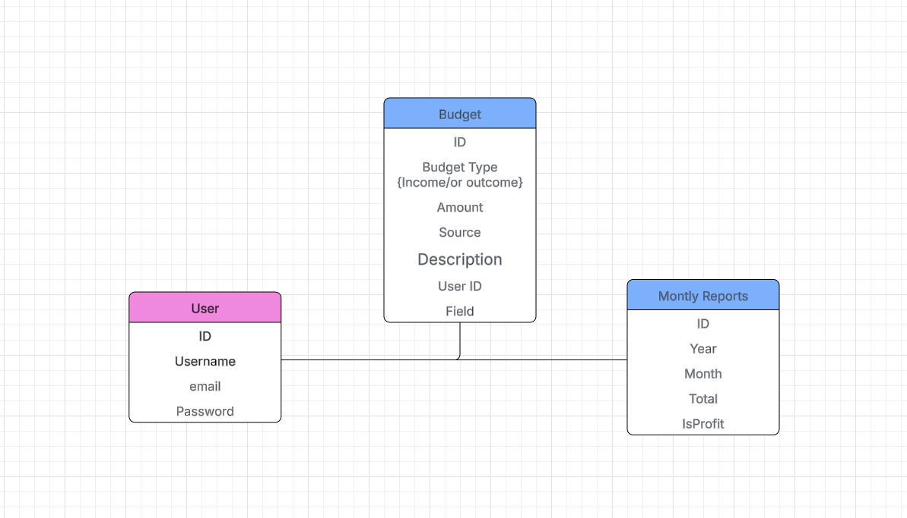
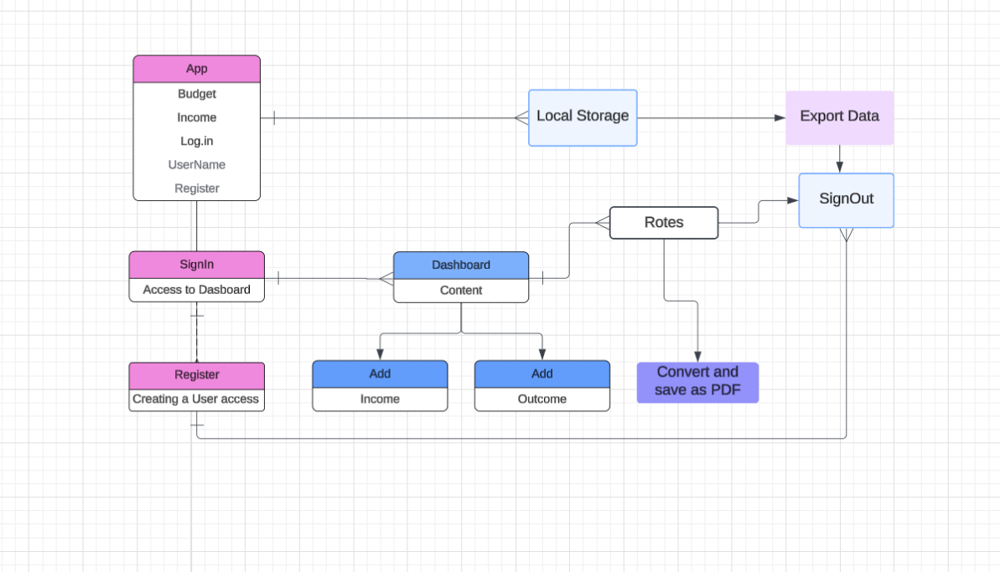

# BudgetBuddy

BudgetBuddy: a web application that allows users to manage their Budget based on Income and outcome of the users. 

# Deployment link: 
https://budgetbuddy-z75h.onrender.com/


# UML Diagram



## Features

- User login and registration
- User budget 
- Income Input
- Budget calculation

## Technologies Used

- Node
- React
- HTML, CSS, JavaScript


## Installation

1. Clone the repository:
   ```bash
   git clone https://github.com/hatchways-community/capstone-project-two-c76ade5651044c2e8871541264f9bc34.git
   cd BudgetBuddy/
  npm run

